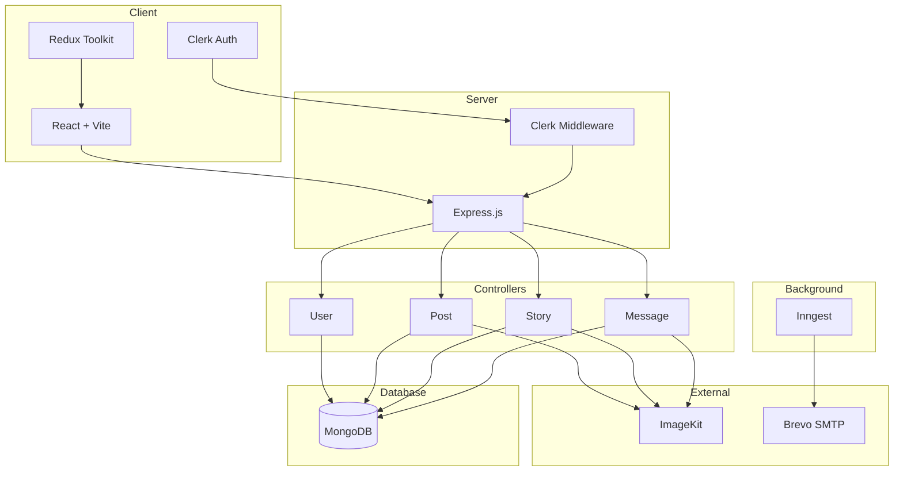
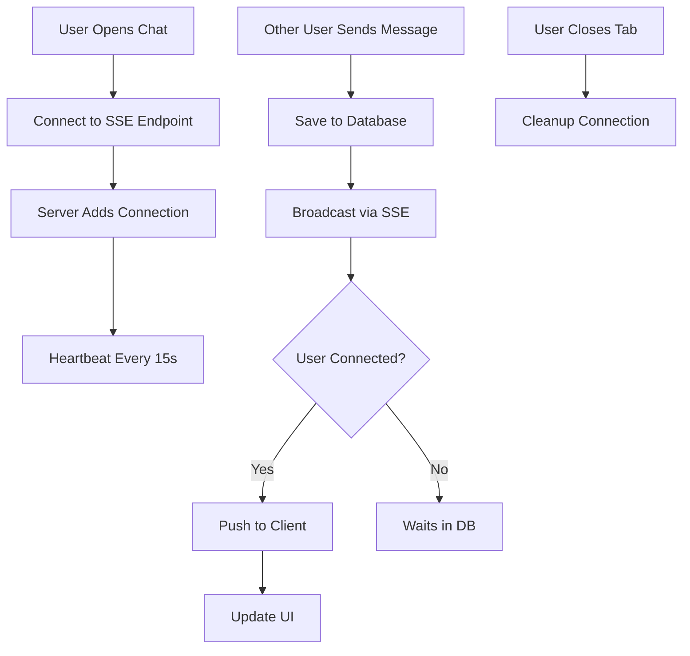
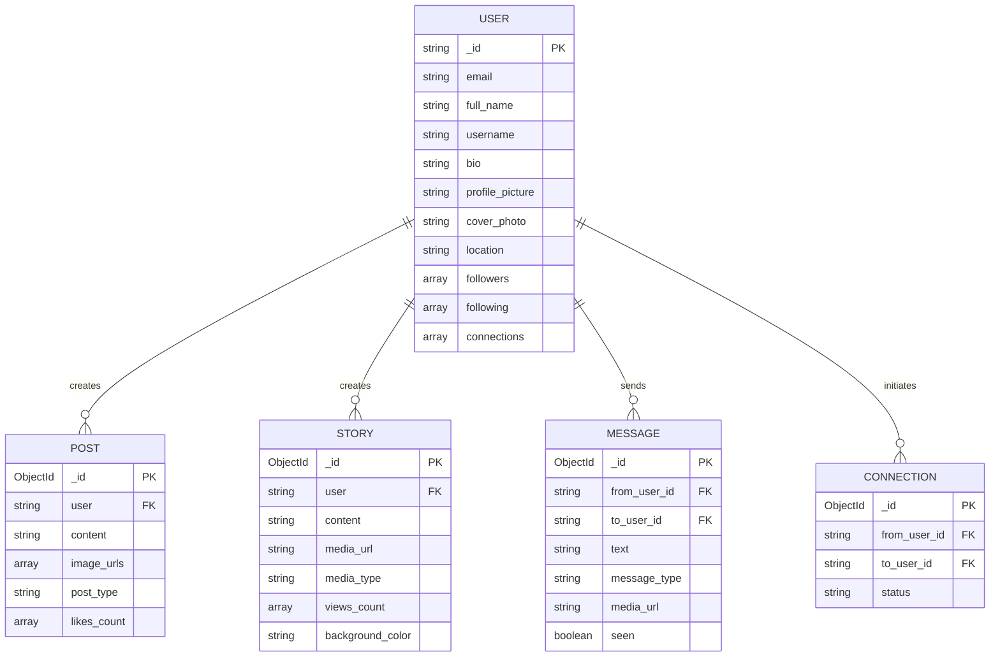

# BuzzConnect

A full-stack social media platform featuring real-time messaging, stories with auto-expiry, user connections, and a responsive feed built with React, Redux Toolkit, and Express.

## Live Demo

- Frontend: https://buzzconnect.vercel.app
- Backend API: https://buzz-connect-server.vercel.app

## Screenshots


## System Architecture



## Real-time Messaging Flow



## Database Schema



## Features

### Core Features

- Real-time messaging using Server-Sent Events (SSE)
- Stories with text, image, or video that auto-delete after 24 hours
- Follow/unfollow users and send connection requests
- Create posts with multiple images
- Like and interact with posts
- Discover users by name, username, or location

### Technical Features

- Real-time updates without WebSocket complexity
- Automated story cleanup via Inngest
- Connection request email notifications
- Daily unseen message digest emails
- Clerk webhook sync for user data
- Image optimization via ImageKit

## Tech Stack

### Frontend

- React 19
- TypeScript
- Vite
- Redux Toolkit
- TailwindCSS
- Clerk
- React Router DOM
- Axios
- Moment.js

### Backend

- Node.js
- TypeScript
- Express
- MongoDB with Mongoose
- Clerk
- ImageKit
- Inngest
- Nodemailer with Brevo SMTP

## Project Structure

```
buzzconnect/
├── client/
│   └── src/
│       ├── api/
│       ├── app/
│       ├── assets/
│       ├── components/
│       ├── features/
│       │   ├── connections/
│       │   ├── messages/
│       │   └── user/
│       ├── pages/
│       └── types/
│
└── server/
    └── src/
        ├── configs/
        ├── controllers/
        ├── inngest/
        ├── middleware/
        ├── models/
        ├── routes/
        ├── types/
        └── utils/
```

## API Endpoints

### User Routes

| Method | Endpoint              | Description             |
| ------ | --------------------- | ----------------------- |
| GET    | /api/user/data        | Get current user        |
| POST   | /api/user/update      | Update profile          |
| POST   | /api/user/discover    | Search users            |
| POST   | /api/user/follow      | Follow user             |
| POST   | /api/user/unfollow    | Unfollow user           |
| POST   | /api/user/connect     | Send connection request |
| POST   | /api/user/accept      | Accept connection       |
| GET    | /api/user/connections | Get all connections     |
| POST   | /api/user/profiles    | Get user profile        |

### Post Routes

| Method | Endpoint       | Description      |
| ------ | -------------- | ---------------- |
| POST   | /api/post/add  | Create post      |
| GET    | /api/post/feed | Get feed posts   |
| POST   | /api/post/like | Like/unlike post |

### Story Routes

| Method | Endpoint          | Description  |
| ------ | ----------------- | ------------ |
| POST   | /api/story/create | Create story |
| GET    | /api/story/get    | Get stories  |

### Message Routes

| Method | Endpoint                  | Description         |
| ------ | ------------------------- | ------------------- |
| GET    | /api/message/:userId      | SSE connection      |
| POST   | /api/message/send         | Send message        |
| POST   | /api/message/get          | Get chat messages   |
| GET    | /api/user/recent-messages | Get recent messages |

## Getting Started

### Prerequisites

- Node.js 20+
- pnpm
- MongoDB Atlas account
- Clerk account
- ImageKit account
- Brevo account
- Inngest account

### Installation

```bash
git clone https://github.com/yourusername/buzzconnect.git
cd buzzconnect

cd server
pnpm install

cd ../client
pnpm install
```

### Environment Variables

Create `.env` files from `.env.example` in both client and server directories.

### Development

```bash
cd server
pnpm dev

cd client
pnpm dev
```

- Frontend: http://localhost:5173
- Backend: http://localhost:5000

## Background Jobs

| Job              | Trigger         | Action                       |
| ---------------- | --------------- | ---------------------------- |
| User Sync        | Clerk webhook   | Create/update/delete user    |
| Story Cleanup    | On story create | Delete after 24 hours        |
| Connection Email | On request      | Send notification + reminder |
| Unseen Messages  | Daily 9 AM      | Send digest email            |

## Author

Vikraman R - [@VIKRAMANR7](https://github.com/VIKRAMANR7)
